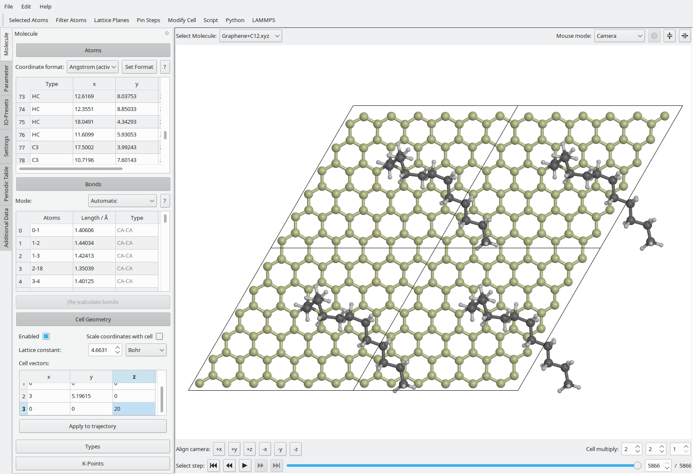

#  VIsual Periodic STructure EditoR

Fast and easy to use graphical editor for periodic atomistic simulations.
For more information, please visit the [Homepage](https://sgsaenger.github.io/vipster).

Binary releases are available [here](https://github.com/sgsaenger/vipster/releases),
installation instructions can be found [here](INSTALL.md).

Last but not least, a (sadly, feature-reduced) browser version can be tried [here](https://sgsaenger.github.io/vipster/emscripten/index.html)!

<table align="center">
  <tr>
    <th colspan=3>
      
      Libvipster
    </th>
  </tr>
  <tr>
    <td colspan=3>C++17 based backbone: Powerful container-classes and I/O</td>
  </tr>
  <tr>
    <th>
      
    </th>
    <th>
      
    </th>
    <th>
      
    </th>
  </tr>
  <tr>
    <td>Fast and native GUI with OGL3.3 based rendering</td>
    <td>Portable browser-based GUI, shared render-code</td>
    <td>Scripting interface for batch-processing</td>
  </tr>
</table>

## Dependencies

- [JSON for Modern C++](https://github.com/nlohmann/json)
- [CLI11](https://github.com/CLIUtils/CLI11)
- [tinyexpr](https://github.com/codeplea/tinyexpr)
- [CMake](https://cmake.org)
- [{fmt}](https://github.com/fmtlib/fmt)
- and a C++17-capable compiler (g++ > 8 or clang > 4)
- optional:
  - [Qt5](https://www.qt.io) (desktop application)
  - [emscripten](http://kripken.github.io/emscripten-site) (web interface)
  - [pybind11](https://github.com/pybind/pybind11) (script interface)
  - [Catch2](https://github.com/catchorg/Catch2) (testing)
  - [LAMMPS](https://lammps.sandia.gov) (interactive forcefield calculations)

## Supported file types

| Format          | Reading  | Writing  |
|-----------------|----------|----------|
| xyz (augmented) | &#10004; | &#10004; |
| PWScf input     | &#10004; | &#10004; |
| PWScf output    | &#10004; |          |
| LAMMPS data     | &#10004; | &#10004; |
| LAMMPS dump     | &#10004; |          |
| CPMD input      | &#10004; | &#10004; |
| Gaussian cube   | &#10004; |          |
| XCrysden        | &#10004; |          |
| ORCA input      | &#10004; | &#10004; |
| VASP Poscar     | &#10004; | &#10004; |
